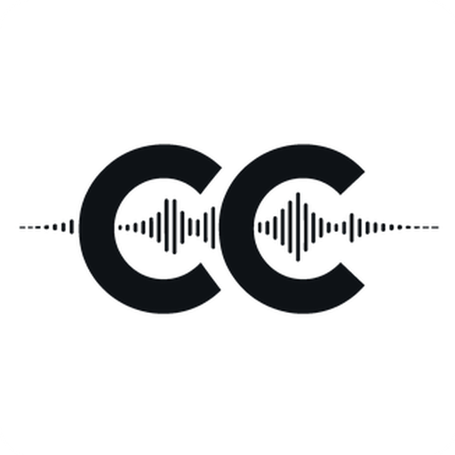
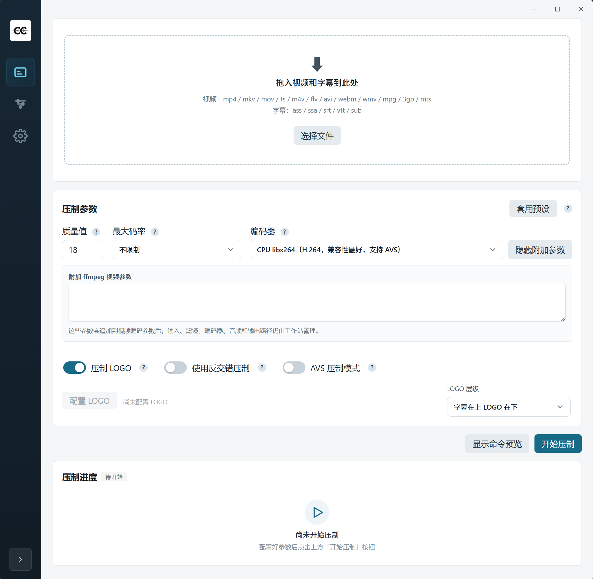
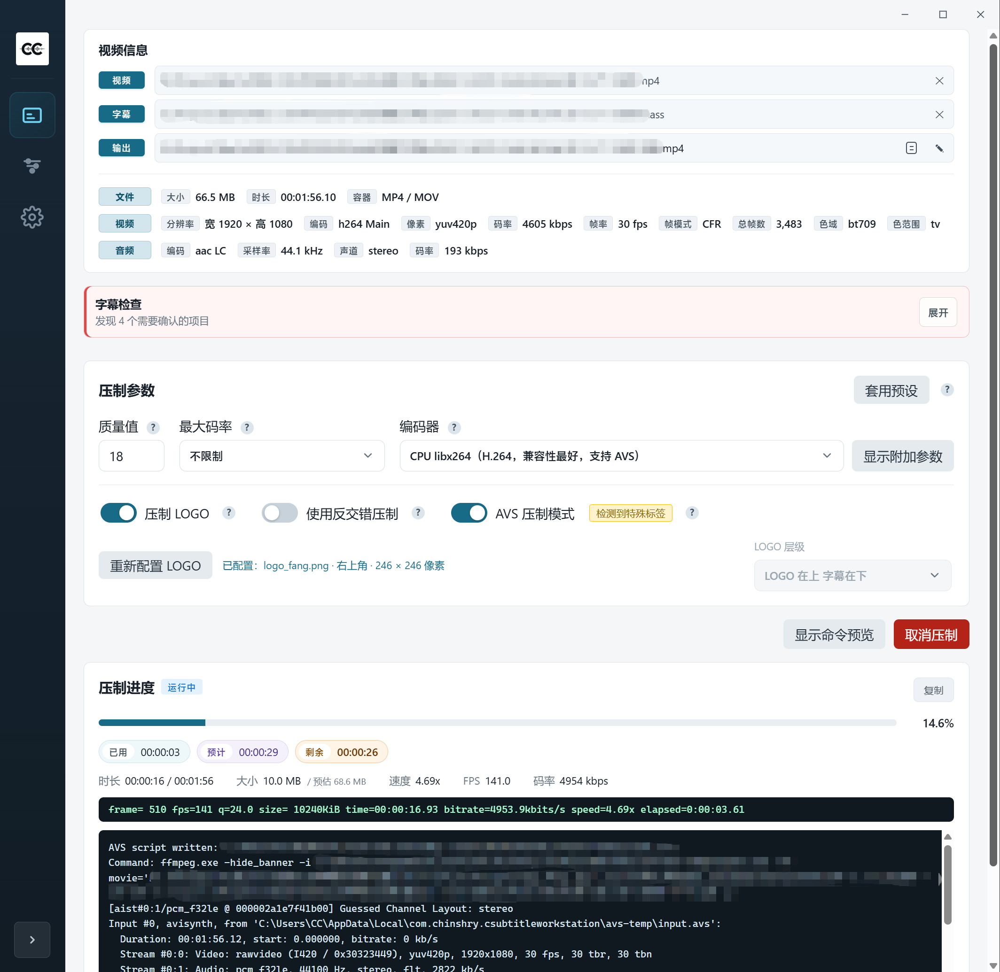
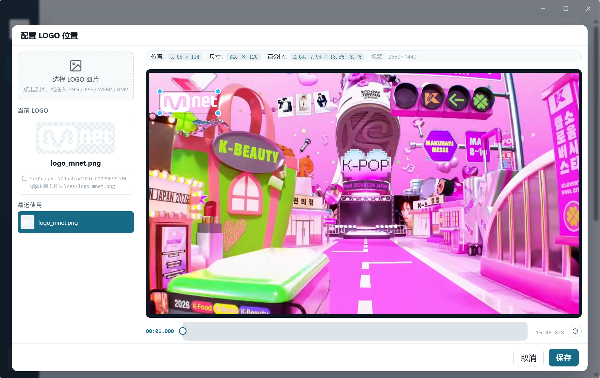
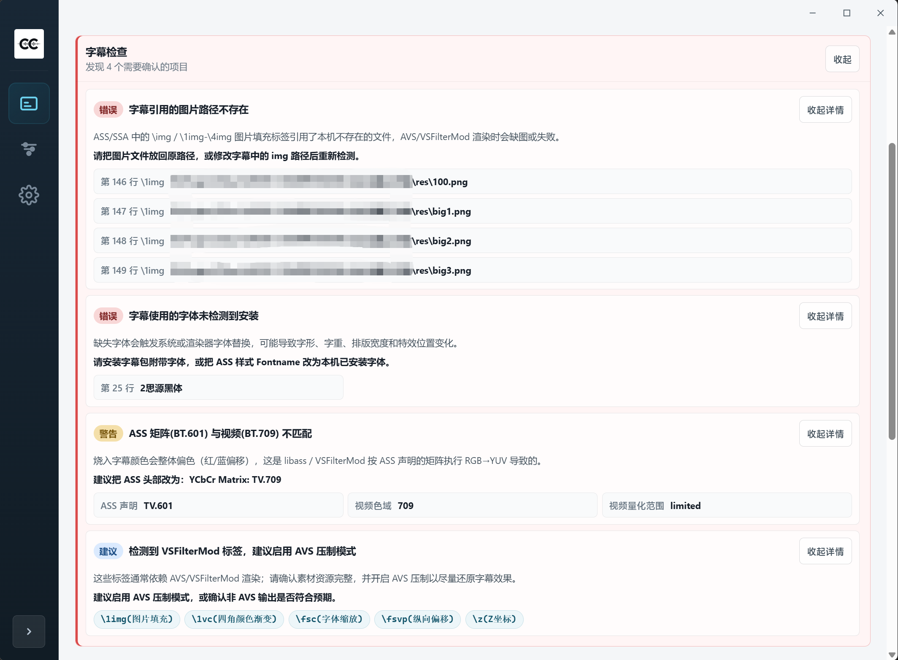
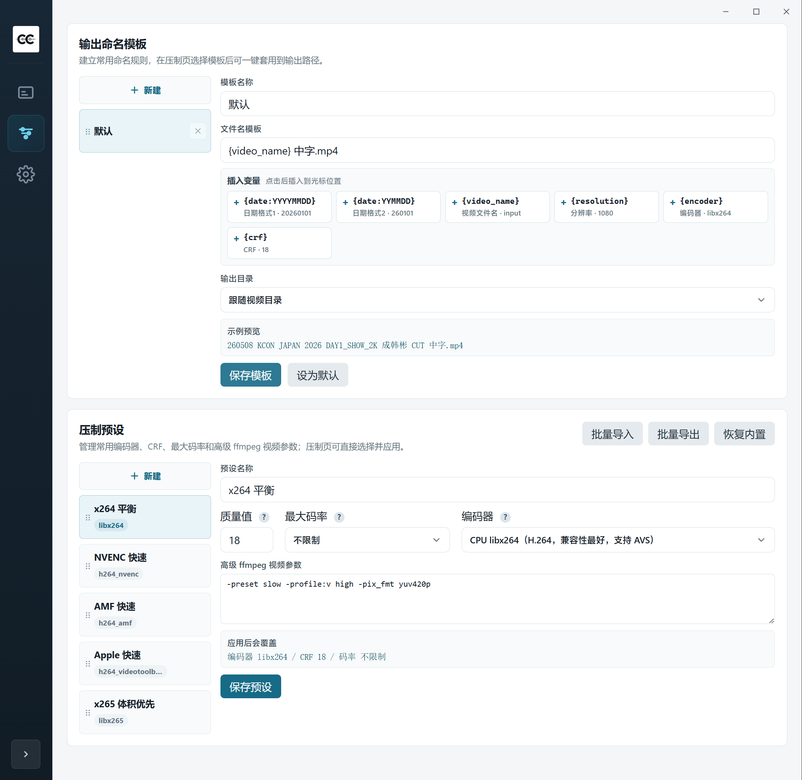
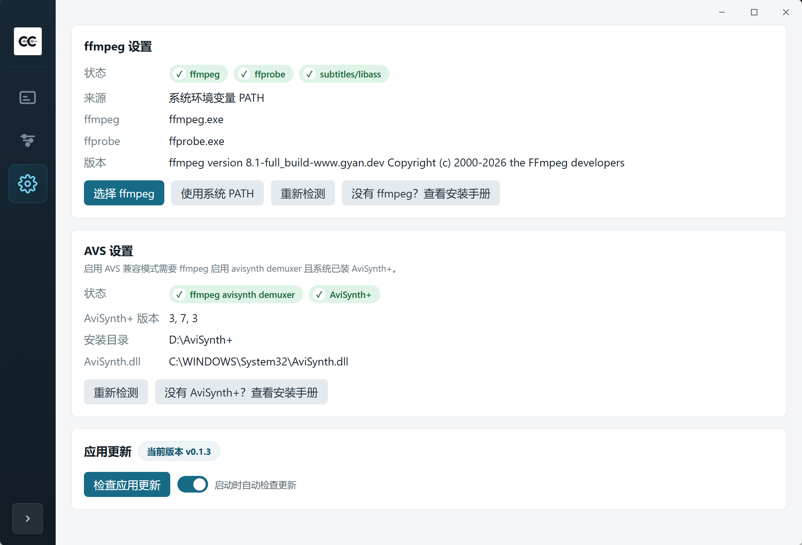

<div align="center">



# CC Subtitle Workstation

**One-click subtitle video encoding with logo overlays, effect subtitles, and real-time progress feedback**

<p>
  <a href="https://github.com/Chinshry/CSubtitleWorkstation/releases">Download</a> ·
  <a href="README.md">简体中文</a> ·
  <a href="docs/DEVELOPMENT_GUIDELINES.md">Development Guide</a> ·
  <a href="https://github.com/Chinshry/CSubtitleWorkstation/issues">Issues</a>
</p>

<p>
  <a href="https://github.com/Chinshry/CSubtitleWorkstation/stargazers"></a>
  <a href="https://github.com/Chinshry/CSubtitleWorkstation/releases"></a>
  <a href="https://github.com/Chinshry/CSubtitleWorkstation/releases"></a>
  <a href="https://github.com/Chinshry/CSubtitleWorkstation/blob/master/LICENSE"></a>
</p>

<p>
  
  
  
  
</p>

Replace traditional subtitle encoding workflows with a visual desktop interface: drag and drop, automatic analysis, visual configuration, real-time feedback, and one-click encoding.

</div>

---

## Why?

Traditional subtitle video encoding often depends on third-party GUI tools such as Xiaowan Toolbox or hand-written BAT scripts. Common problems include:

- **Complicated parameters**: ffmpeg has many command-line options that are easy to get wrong and hard to reuse.
- **Missing feedback**: encoding windows can flash and close immediately, leaving no real-time progress or logs.
- **Poor cross-platform support**: Xiaowan Toolbox is Windows-only, leaving macOS and Linux users without the same workflow.
- **Opaque video metadata**: resolution, frame rate, codec, and other details usually require manual ffprobe checks.
- **Difficult AVS encoding**: effect subtitles require manually written AviSynth scripts for complex effects and vector drawings. Parameters are hard to debug, encoding is slow, and users often cannot tell whether an ASS file is "normal" or effect-heavy until after a failed encode.
- **Difficult logo insertion**: traditional workflows rely on ASS img tags or vector drawing commands, which require effect subtitle rendering. This app uses ffmpeg's overlay filter to place logos directly on video, so logo overlays do not require AVS effect subtitle encoding.

**CC Subtitle Workstation** solves these issues with a visual workflow: drag and drop, automatic video analysis, visual parameter setup, real-time progress feedback, and one-click encoding. It supports **Windows and macOS** out of the box.

---

## Features

### Main Encoding Workflow

- **Drag-and-drop import**: drop videos and subtitles into the window to start. Single-video tasks and video + subtitle imports are both supported.
- **Video metadata analysis**: automatically reads resolution, frame rate, codec, duration, CFR/VFR status, and other key details.
- **Visual encoding options**: configure quality, bitrate, and encoder in one place. Quality can be left empty, in which case `-crf`, `-cq`, or `-qp` is not generated.
- **Video processing**: deinterlace, rotate, mirror, scale, adjust frame rate, and set video bitrate in the same encoding task.
- **Command preview and logs**: expand the full ffmpeg command before starting. During encoding, view progress, speed, fps, bitrate, output size, and stdout/stderr.
- **Task cancellation**: cancel an encoding task and let ffmpeg exit gracefully. Already written segments are preserved as playable output whenever possible.

### Subtitles and Logo

- **Standard subtitle burn-in**: renders ASS / SSA / SRT / VTT / SUB subtitles with ffmpeg libass.
- **Effect subtitle detection** (Windows): scans VSFilterMod extension tags and suggests AVS encoding when they are detected.
- **AVS effect subtitle encoding** (Windows): uses AviSynth+ / VSFilterMod to process complex ASS effects, vector drawings, and img tags.
- **Subtitle check panel**: reports missing images, missing fonts, missing styles, ASS color matrix issues, and effect tag risks.
- **Visual logo editor**: drag and resize logos on extracted video frames. Layouts are saved by resolution and orientation, and the subtitle/logo layer order can be configured.

### Tools Page

- **Text tools**
  - **CC subtitle organizer**: splits web CC speaker labels, organizes decorative text lines and transcription lines, and supports SRT to ASS conversion.
  - **Simplified/Traditional Chinese conversion**: live preview, diff highlighting, synchronized scrolling, and custom dictionary priority matching.
  - **Subtitle proofreading**: checks suspicious Chinese "的 / 地 / 得" usage, supports custom dictionaries, regular expressions, and test matching, and only suggests changes instead of replacing automatically.
- **Format conversion**
  - **Subtitle format conversion**: convert between ASS / SSA / SRT / VTT. Dropping a single subtitle can open the tool directly.
  - **Video to MP4**: remux common video containers to MP4. Stream copy is used by default with no re-encoding.
- **Media processing**
  - **TS segment merge**: merge TS / M2TS / MTS segments in order and output MP4 without re-encoding.
  - **Merge audio and video**: keep the original video stream and mux a separate audio source into MP4.
  - **Add cover image**: write JPG / PNG cover art into MP4 while copying original audio and video streams.

### Presets

- **Encoding preset management**: built-in x264, x265, NVENC, AMF, and VideoToolbox presets, with custom create/edit/import/export support.
- **Output filename templates**: supports variables such as `{video_name}`, `{resolution}`, `{encoder}`, `{crf}`, and `{date:YYYYMMDD}`.

### Environment and Updates

- **Application update checks**: silently check on startup or manually check from Settings. New versions are announced with Toast notifications.
- **macOS compatibility checks**: verifies whether ffmpeg contains the `subtitles` / `ass` filters and suggests `ffmpeg-full` when they are missing.

---

## Supported Formats

| Type | Supported formats |
|------|-------------------|
| **Video** | MP4, MKV, MOV, TS, M4V, FLV, AVI, WebM, WMV, MPG, MPEG, 3GP, 3G2, RM, RMVB, VOB, MTS, M2TS |
| **Subtitle** | ASS, SSA, SRT, VTT, SUB |
| **Text / subtitle tools** | TXT, ASS, SSA, SRT, VTT, SUB |
| **Logo** | PNG, JPG, JPEG, WebP, BMP |

---

## Platform Support

| Feature | Windows | macOS |
|------|---------|-------|
| **Basic encoding** | Supported | Supported |
| **Video metadata analysis** | Supported | Supported |
| **Logo overlay** | Supported, selectable layer order | Supported, subtitles are always above logo |
| **Deinterlace** | Supported | Supported |
| **Effect subtitle encoding** | Supported | Not supported |
| **subtitles/ass filter check** | Supported | Supported, with `ffmpeg-full` hint when missing |
| **Hardware acceleration** | NVIDIA NVENC, AMD AMF | Apple VideoToolbox |
| **Installer format** | NSIS installer | Universal DMG for Intel and Apple Silicon |

> The macOS version does not support effect subtitle encoding because AviSynth+ is Windows-only. It always uses ffmpeg libass subtitle rendering.
> The macOS version uses a fixed logo layer order: subtitles above logo. Switching logo above subtitles is not supported.
> Minimal macOS ffmpeg builds, such as `brew install ffmpeg`, may not include `--enable-libass`. The app checks this on startup. If the `subtitles` / `ass` filters are missing, install `ffmpeg-full`.

---

## Screenshots

<table>
  <tr>
    <td width="50%" align="center">
      <a href="docs/screenshots/01-home.png"></a>
      <br/><sub><b>Home</b> · Drag in videos and subtitles to start, with encoding options visible at a glance</sub>
    </td>
    <td width="50%" align="center">
      <a href="docs/screenshots/02-encoding.png"></a>
      <br/><sub><b>Encoding</b> · Video metadata, subtitle checks, real-time progress, and ffmpeg logs</sub>
    </td>
  </tr>
  <tr>
    <td width="50%" align="center">
      <a href="docs/screenshots/03-logo-editor.png"></a>
      <br/><sub><b>Logo editor</b> · Drag and resize logos on extracted frames, with canvas zoom and saved layouts by resolution/orientation</sub>
    </td>
    <td width="50%" align="center">
      <a href="docs/screenshots/04-subtitle-check.png"></a>
      <br/><sub><b>Subtitle checks</b> · Missing images, missing fonts, color matrix warnings, and effect tag risk levels</sub>
    </td>
  </tr>
  <tr>
    <td width="50%" align="center">
      <a href="docs/screenshots/05-presets.png"></a>
      <br/><sub><b>Preset management</b> · Encoding presets and output filename templates with import/export support</sub>
    </td>
    <td width="50%" align="center">
      <a href="docs/screenshots/06-settings.png"></a>
      <br/><sub><b>Tools / Settings</b> · Proofreading, Chinese conversion, CC subtitle cleanup, subtitle conversion, remuxing, custom dictionaries, and ffmpeg / AviSynth+ checks</sub>
    </td>
  </tr>
</table>

---

## Download and Installation

Download the latest version from the [Releases page](https://github.com/Chinshry/CSubtitleWorkstation/releases).

### Windows

Download `CSubtitleWorkstation_x.y.z_x64-setup.exe` and run the installer.

### macOS

Download `CSubtitleWorkstation_x.y.z_universal.dmg`. **The same DMG supports both Apple Silicon (M1/M2/M3/M4) and Intel Macs**.

#### What if macOS says the developer cannot be verified?

This project is not currently signed with an Apple Developer certificate, so macOS Gatekeeper may block the first launch:

1. Double-click the `.dmg` file and drag the app into the Applications folder.
2. In Applications, **right-click** CSubtitleWorkstation and choose **Open**.
3. When the "cannot verify developer" dialog appears, choose **Open** again.

If this does not work on macOS 14 or later:

1. Double-click the app once so macOS shows the blocked launch prompt, then close it.
2. Open **System Settings** -> **Privacy & Security**.
3. Scroll to the bottom, find the blocked CSubtitleWorkstation message, choose **Open Anyway**, and confirm with your password.

> This only needs to be done once per app installation. After that, double-clicking the app works normally.

---

## FAQ

<details>
<summary><strong>Where do I configure ffmpeg?</strong></summary>

The app automatically checks for `ffmpeg` on the system PATH at startup. If detection fails, or if you want to use a specific build, open Settings and select the ffmpeg executable manually. The app automatically looks for `ffprobe` in the same directory.

Recommended ffmpeg builds:

- Windows: Gyan.dev `ffmpeg-release-full.7z`, which includes `ffprobe` and supports more filters and demuxers.
- macOS: if subtitle encoding reports missing `subtitles` / `ass` filters, install Homebrew `ffmpeg-full`.

</details>

<details>
<summary><strong>Can macOS encode effect subtitles?</strong></summary>

No. The macOS version does not support the AVS / VSFilterMod workflow and can only render subtitles with ffmpeg libass. Standard ASS / SSA / SRT subtitles work normally. Subtitles that depend on VSFilterMod extension tags will show a risk warning, but AVS will not be enabled automatically.

If a normal subtitle reports missing `subtitles` / `ass` filters, the current ffmpeg build is incomplete. Install `ffmpeg-full`, then re-check in Settings or manually select the new ffmpeg path.

</details>

<details>
<summary><strong>What does AVS mode require?</strong></summary>

AVS mode is Windows-only. It requires AviSynth+ to be installed and an ffmpeg build with `--enable-avisynth`. Gyan.dev `ffmpeg-release-full.7z` is recommended because it includes ffprobe and AviSynth+ support.

</details>

<details>
<summary><strong>What extra requirements apply to VP9 video in AVS mode?</strong></summary>

VP9 video in AVS mode uses a fallback flow: the app first copies the source video to a temporary ASCII path, then reads it through the local 64-bit DirectShow decoder chain to avoid possible frame drops during VP9 AVS encoding.

Only the **VP9 + AVS** combination requires 64-bit LAV Filters. Normal AVS subtitle encoding does not depend on LAV Filters, and non-AVS encoding does not require this step. The VP9 DirectShow decoder panel in Settings can check the x64 LAV Filters components and DirectShow registration status.

If the source video is large, the temporary copy consumes roughly the same amount of disk space. During this copy, ffmpeg progress may stay at 0%. The confirmation dialog shows the temporary space requirement and path.

</details>

<details>
<summary><strong>Can I cancel encoding?</strong></summary>

Yes. Click **Cancel** and ffmpeg receives SIGINT, equivalent to Ctrl+C. The already encoded portion is written correctly so the output remains playable when possible.

</details>

<details>
<summary><strong>What subtitles are detected as effect subtitles?</strong></summary>

The app only detects **VSFilterMod-specific extension tags**. These tags are not part of the standard ASS/SSA specification, cannot be rendered by libass, and require AVS + VSFilterMod for correct output. Any matching tag marks the subtitle as effect-heavy:

| Category | Tags |
|------|------|
| Scale / blur / offset | `\fsc`, `\xblur`, `\yblur`, `\fsvp`, `\fshp` |
| Four-corner gradients | `\1vc`-`\4vc` for color, `\1va`-`\4va` for alpha |
| Jitter / deformation | `\jitter`, `\rnd*`, `\distort`, `\frs` |
| 3D / space | `\z`, `\ortho` |
| Special movement | `\mover`, `\moves3/4`, `\movevc` |
| Image fill | `\1img`-`\4img` |

> Detection runs automatically after a subtitle is selected. The frontend shows a message such as "Detected \xxx effect tags; AVS encoding has been enabled automatically." If the current platform does not support AVS, such as macOS or a Windows system without AviSynth+, the app warns but does not force AVS. Standard ASS tags such as `\b`, `\i`, `\c`, and `\pos` continue to use ffmpeg libass and are not treated as effect subtitles.

</details>

<details>
<summary><strong>What do errors, warnings, and suggestions mean in the subtitle check panel?</strong></summary>

- **Errors**: likely to affect output directly, such as missing subtitle images, missing fonts, or missing styles. Fix these before encoding.
- **Warnings**: may affect the look of the video or subtitles, such as a missing ASS color matrix or mismatched video metadata. Encoding can continue, but fixing them is recommended.
- **Suggestions**: may not fail the task, but there may be a better workflow, such as using AVS when VSFilterMod effect tags are detected.

Subtitle checks do not modify subtitle files. They only report risks and suggest handling directions.

</details>

<details>
<summary><strong>How are logo layouts saved?</strong></summary>

Layouts saved in the logo editor are persisted in local configuration by logo image and resolution bucket. Opening a matching video later restores the layout automatically. Six buckets are supported: 720p, 1080p, and 4K for landscape and portrait videos.

The editor has two zoom concepts: resizing the logo itself determines the final encoded logo size, while preview canvas zoom helps with fine positioning and does not affect output size. Canvas zoom can be controlled with shortcuts or by entering a scale value. When the logo loses focus, resize anchors hide automatically so they do not cover the preview.

</details>

<details>
<summary><strong>Where are encoding presets and output filename templates managed?</strong></summary>

The sidebar Presets page manages both resources:

- **Encoding presets**: includes built-in `x264 Balanced`, `x265 Size First`, `NVENC Fast`, `AMF Fast`, and `Apple Fast` presets. You can create, edit, delete, import, and export custom presets. `customVideoArgs` can extend ffmpeg parameters freely.
- **Output filename templates**: supports variables such as `{video_name}`, `{resolution}`, `{encoder}`, `{crf}`, `{date:YYYYMMDD}`, and `{date:YYMMDD}`. Output can be set to the video directory or a fixed directory, and multiple templates can be saved and marked as default.

The Home page switches the active task preset and template directly with dropdowns.

</details>

<details>
<summary><strong>How do custom dictionaries work?</strong></summary>

Two text tools support custom dictionaries with different purposes:

- **Subtitle proofreading**: open Tools -> Subtitle Proofreading. Paste text or drop TXT / ASS / SSA / SRT / VTT / SUB files. The app marks suspicious Chinese "的 / 地 / 得" usage and custom dictionary matches. Clicking an issue locates the source text; clicking **Apply** performs the replacement. Nothing is changed automatically. Proofreading dictionary rules consist of a standard spelling and a match rule. Match rules support regular expressions, and `%1` references the first captured group.
- **Simplified/Traditional Chinese conversion**: open Tools -> Chinese Conversion. Pasted text is converted live, with diff highlighting and synchronized scrolling. Each custom dictionary entry can use `source = target`, `source -> target`, `source => target`, or tab separation. Dictionary entries have the highest priority and are protected before base conversion runs. For example, `朴乾旭 = 朴乾旭` prevents the name from being converted incorrectly.

Both dictionaries are saved in local configuration and restored next time. The test matching area in the dictionary dialog lets you enter sample text and inspect what the current rules match and suggest. When dropping TXT files into Chinese conversion, the app only reads and previews the result; click **Export Result** to write output, with overwrite confirmation when the target file already exists.

</details>

<details>
<summary><strong>What local configuration and cache does the app store?</strong></summary>

The app stores configuration, window state, subtitle proofreading dictionaries, Chinese conversion dictionaries, WebView cache, temporary encoding subtitles, logo preview frames, and AVS temporary scripts under the system user directory. See [Cache and User Data](docs/CACHE_AND_DATA.md) for full paths and cleanup guidance.

</details>

---

## Advanced

<details>
<summary><strong>Development environment and commands</strong></summary>

### Requirements

- Node.js + npm
- Rust / Cargo for the Tauri backend
- Tauri desktop dependencies: WebView2 / Visual C++ Build Tools on Windows, Xcode Command Line Tools on macOS
- Local `ffmpeg` installation, or an ffmpeg executable selected in Settings

### Development Commands

```bash
npm install
npm run tauri dev      # development mode
npm run tauri build    # package the desktop app
npm run build          # frontend build only
```

</details>

<details>
<summary><strong>Design principles</strong></summary>

- **ffmpeg is not bundled**: users install or select it themselves. Gyan.dev `ffmpeg-release-full.7z` is recommended because it includes ffprobe and AviSynth+ support.
- **Automatic ffprobe lookup**: when selecting an ffmpeg executable, the app looks for ffprobe in the same directory automatically.
- **App updates and ffmpeg version checks are independent**: they do not affect each other.
- **Effect subtitle encoding is Windows-only**: it requires AviSynth+ and an ffmpeg build with `--enable-avisynth`.
- **macOS / Linux do not support effect subtitle encoding**: they always use ffmpeg filter mode with libass subtitle rendering.
- **No shell invocation**: ffmpeg and ffprobe are called directly through Rust `std::process::Command`, so filenames with special characters do not require shell escaping.

</details>

---

## Star History

[](https://www.star-history.com/#Chinshry/CSubtitleWorkstation&Date)

---

## Contributing

Issues and suggestions are welcome. Before submitting a PR, make sure the code passes linting and tests.

## Documentation

- [Development Guidelines](docs/DEVELOPMENT_GUIDELINES.md) - Project development guide
- [Cache and User Data](docs/CACHE_AND_DATA.md) - Local configuration, cache, and temporary file locations
