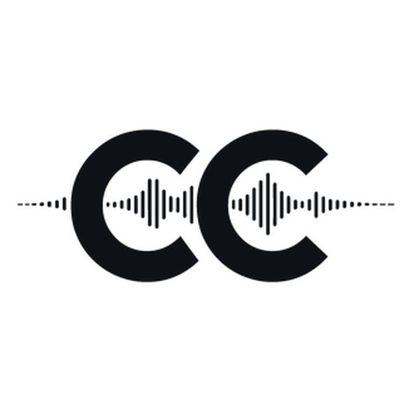

<div align="center">



# CC 字幕压制工作站

**Tauri 2 + Vue 3 + TypeScript 桌面应用**

<p>
  <a href="https://github.com/Chinshry/CSubtitleWorkstation/releases">📥 下载</a> ·
  <a href="docs/REQUIREMENTS.md">📖 需求文档</a> ·
  <a href="https://github.com/Chinshry/CSubtitleWorkstation/issues">🐛 反馈问题</a>
</p>

<p>
  <a href="https://github.com/Chinshry/CSubtitleWorkstation/stargazers"></a>
  <a href="https://github.com/Chinshry/CSubtitleWorkstation/releases"></a>
  <a href="https://github.com/Chinshry/CSubtitleWorkstation/releases"></a>
  <a href="https://github.com/Chinshry/CSubtitleWorkstation/blob/master/LICENSE"></a>
</p>

<p>
  
  
  
  
</p>

用可视化界面替代传统字幕压制工作流。拖拽导入 → 自动解析 → 可视化配置 → 实时反馈 → 一键压制。

</div>

---

## 💡 Why?

传统字幕压制工作流依赖**小丸工具箱**等第三方 GUI 工具或 BAT 脚本，存在以下痛点：

- **参数繁琐**：ffmpeg 命令行参数众多，易出错，难以复用
- **反馈缺失**：工具窗口闪现即关，看不到实时进度和日志
- **跨平台困难**：小丸工具箱仅 Windows，macOS/Linux 用户无法使用
- **视频信息不透明**：需要手动用 ffprobe 查询分辨率、帧率、编码器等
- **AVS 压制困难**：需要手动编写 AviSynth 脚本来处理特效字幕（如复杂特效、矢量绘制等），参数复杂，调试困难，且耗时
- **LOGO 添加困难**：传统方式需要用 ASS 字幕的 img 标签或矢量绘制命令，这些都需要特效字幕压制才能实现，流程复杂且耗时。本应用采用 ffmpeg overlay filter 直接在视频上叠加 LOGO，不需要特效字幕压制，更高效

**CC 字幕压制工作站** 用可视化界面解决这些问题：拖拽导入 → 自动解析视频 → 可视化配置参数 → 实时进度反馈 → 一键压制。**支持 Windows 和 macOS**，开箱即用。

---

## ✨ Features

- 🎬 **拖拽导入** — 把视频和字幕直接拖到窗口，自动按扩展名分发
- 📊 **视频信息卡** — 自动调用 ffprobe 解析分辨率、帧率、编码器、时长等，支持 CFR/VFR 识别
- 🎨 **可视化参数** — CRF、码率、编码器（x264/NVENC/AMF/VideoToolbox）一目了然
- 🖼️ **LOGO 可视化编辑 + 布局保存** — 在视频抽帧上拖放 LOGO，支持四角缩放，为不同分辨率（720p/1080p/4K）和屏幕方向（横/竖屏）各自保存一套 LOGO 位置，下次打开自动恢复
- 🎞️ **反交错处理** — yadif 可选开关，处理交错素材
- 🔤 **特效字幕压制**（仅 Windows）— 使用 AviSynth+ 脚本引擎处理复杂特效字幕（如矢量绘制、img 标签等），相比 ffmpeg libass 支持更完善
- 👁️ **命令预览** — 开始压制前预览完整 ffmpeg 参数
- 📈 **实时进度** — 进度条、当前时间/总时长、输出大小、速度、fps、码率、原始 status 行
- 📝 **完整日志** — ffmpeg stdout/stderr 全程透出，按 `\r` 与 `\n` 两种分隔符切行
- ⏹️ **取消任务** — 压制过程中随时取消，进程优雅退出，已编码片段保留可播放

---

## 📋 支持格式

| 类型 | 支持格式 |
|------|---------|
| **视频** | MP4, MKV, MOV, TS, M4V, FLV, AVI, WebM, WMV, MPG, MPEG, 3GP, 3G2, RM, RMVB, VOB, MTS, M2TS |
| **字幕** | ASS, SSA, SRT, VTT, SUB |
| **LOGO** | PNG, JPG, JPEG, WebP, BMP |

---

## 🖥️ 支持平台

| 功能 | Windows | macOS |
|------|---------|-------|
| **基础压制** | ✅ | ✅ |
| **视频信息解析** | ✅ | ✅ |
| **LOGO 叠加** | ✅ 可选层级（字幕上/下） | ✅ 仅字幕在上 LOGO 在下 |
| **反交错** | ✅ | ✅ |
| **特效字幕压制** | ✅ | ❌ |
| **硬件加速** | NVIDIA NVENC、AMD AMF | Apple VideoToolbox |
| **安装包格式** | NSIS 安装程序 | Universal DMG（Intel + Apple Silicon） |

> macOS 版本不支持特效字幕压制（AviSynth+ 仅 Windows），统一使用 ffmpeg libass 字幕渲染。
> macOS 版本 LOGO 层级固定为"字幕在上 LOGO 在下"，不支持切换到"LOGO 在上 字幕在下"。

---

## 📸 演示

> 待补充：拖拽压制过程 GIF 或截图

---

## 📥 下载与安装

最新版本请到 [Releases 页面](https://github.com/Chinshry/CSubtitleWorkstation/releases) 下载。

### Windows

下载 `CSubtitleWorkstation_x.y.z_x64-setup.exe`，双击安装即可。

### macOS

下载 `CSubtitleWorkstation_x.y.z_universal.dmg`，**同一个 DMG 同时兼容 Apple Silicon (M1/M2/M3/M4) 与 Intel Mac**，无需区分。

#### 首次打开提示「无法验证开发者」怎么办

由于本项目目前没有 Apple 开发者证书签名，macOS Gatekeeper 会在首次打开时拦截：

1. 双击 `.dmg` 挂载磁盘镜像，把应用拖到「应用程序」文件夹
2. 在「应用程序」里**右键点击** CSubtitleWorkstation → 选「打开」
3. 弹出「无法验证开发者」对话框 → 再次点「打开」

如果 macOS 14+ 上述步骤无效（Apple 在新版系统收紧了快捷绕过）：

1. 双击应用让系统弹出拦截提示后关闭
2. 进入「系统设置」→「隐私与安全性」
3. 滑到底部能看到「已阻止使用"CSubtitleWorkstation"」→ 点「仍要打开」→ 输入密码确认

> 此操作每个应用只需做一次，之后双击即可正常打开。

---

## ❓ FAQ

<details>
<summary><strong>ffmpeg 在哪里配置？</strong></summary>

应用启动时会自动检测系统 PATH 上的 `ffmpeg`。如果检测失败或想指定其他版本，进入「设置」页面手动选择 ffmpeg 可执行文件路径。应用会自动在同目录寻找 `ffprobe`。

</details>

<details>
<summary><strong>AVS 模式需要什么环境？</strong></summary>

仅 Windows 支持。需要系统已安装 AviSynth+ 且 ffmpeg 启用了 `--enable-avisynth` 构建。推荐使用 Gyan.dev 的 `ffmpeg-release-full.7z`，其中包含 ffprobe 与 AviSynth+ 支持。

</details>

<details>
<summary><strong>LOGO 布局怎么保存？</strong></summary>

在压制页 LOGO 编辑器中保存过的布局会按 (LOGO 图, 分辨率桶) 持久化到本地配置。下次打开同样的视频自动恢复。支持 6 个桶：720p/1080p/4K × 横屏/竖屏。

</details>

<details>
<summary><strong>压制过程中能取消吗？</strong></summary>

可以。点击「取消」按钮，ffmpeg 进程会收到 SIGINT 信号优雅退出（相当于 Ctrl+C），已编码的部分会被正确写入文件尾，保证输出仍然可播放。

</details>

---

## 🔧 高级信息

<details>
<summary><strong>开发环境与命令</strong></summary>

### 环境要求

- Node.js + npm
- Rust / Cargo（Tauri 后端）
- Tauri 桌面依赖（Windows: WebView2 / Visual C++ Build Tools；macOS: Xcode Command Line Tools）
- 本机已安装 `ffmpeg`，或在设置页选择 `ffmpeg` 可执行文件

### 开发命令

```bash
npm install
npm run tauri dev      # 开发模式
npm run tauri build    # 打包
npm run build          # 仅前端构建
```

</details>

<details>
<summary><strong>设计原则</strong></summary>

- **不内置 ffmpeg**：由用户自行安装或指定。推荐 Gyan.dev 的 `ffmpeg-release-full.7z`（包含 ffprobe 与 AviSynth+ 支持）
- **自动 ffprobe 定位**：选择 ffmpeg 可执行文件时，应用会自动在同目录寻找 ffprobe，无需单独配置
- **应用更新与 ffmpeg 版本检测独立**：两者互不影响
- **特效字幕压制（仅 Windows）**：需要系统已安装 AviSynth+ 且 ffmpeg 启用了 `--enable-avisynth` 构建
- **macOS / Linux 不支持特效字幕压制**：统一走 ffmpeg filter 模式（libass 字幕渲染）
- **无 shell 调用**：直接通过 Rust `std::process::Command` 调用 ffmpeg / ffprobe，文件名中包含特殊字符无需转义

</details>

---

## 📊 Star History

[](https://www.star-history.com/#Chinshry/CSubtitleWorkstation&Date)

---

## 🤝 Contributing

Issues 和建议欢迎！提交 PR 前请确保代码通过 linter 和测试。

## 📚 文档

- [需求与技术方案](docs/REQUIREMENTS.md) — 项目设计文档
- [待办事项](docs/TODO.md) — 功能路线图与已知问题

## 📄 License

MIT © Chinshry
